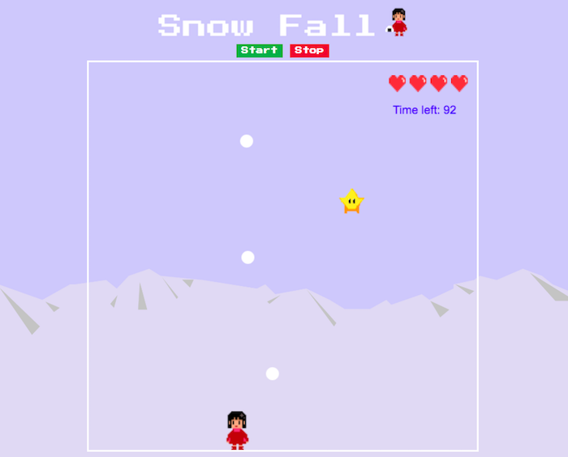

# Canvas Game - "Snow Fall"

Developed this game during a first project week at a coding bootcamp Ironhack.
[Link to the game](https://youxiberlin.github.io/snow-fall-game/)

### How to play

It's a simple game where the player girl can gain a point when she catches a star and loses a point when she gets hit by snow.  
You can move her right and left with keyboard. 
If you can get 17 points within 100 secnods, you win. 

Good luck! :)

